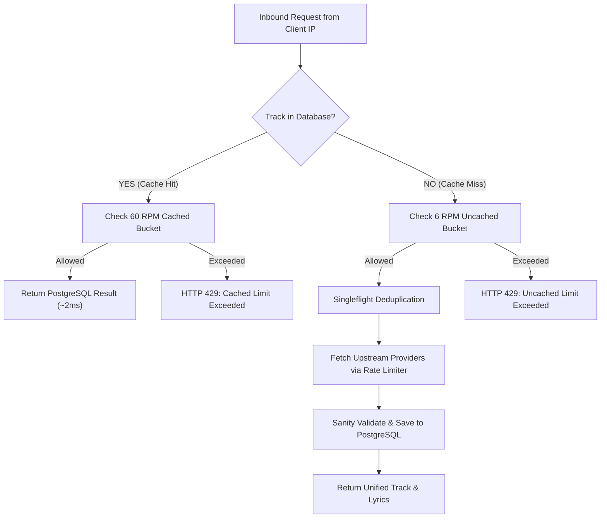

## Overview

LyricsDB implements a multi-tier protection architecture designed to:
1. **Prevent Upstream Provider Exhaustion**: Protect external music services (Spotify, Apple Music, Deezer, NetEase, QQ Music, Musixmatch, LRCLIB) from rate limits and captchas.
2. **Eliminate Database Pollution**: Reject malformed platform IDs, unverified URLs, and invalid metadata before touching PostgreSQL.
3. **Ensure High Availability**: Provide generous limits for fast database reads while throttling expensive live upstream resolutions.

---

## Differentiated IP Rate Limits

LyricsDB differentiates between **cached lookups** (fast sub-millisecond database queries) and **uncached resolutions** (heavy live network scrapes across streaming providers):

| Request Type | Limit (per IP) | Window | Description |
| :--- | :--- | :--- | :--- |
| **Cached Lookups** | **60 req / min** | Sliding 60s | Fast reads for tracks, lyrics, and searches already indexed in PostgreSQL (~2ms response). |
| **Uncached Live Resolutions** | **6 req / min** | Sliding 60s | Heavy live resolution across upstream platforms when a song is queried for the first time. |
| **Burst Protection** | **15 req / sec** | Sliding 1s | Global anti-flood burst limit applied across all API endpoints. |

### Applicable Endpoints

#### Cached Lookups (60 RPM per IP)
- `GET /api/tracks` *(when track exists in DB cache)*
- `GET /api/tracks/:id` *(internal UUID lookup)*
- `GET /api/tracks/:id/lyrics` *(retrieval from DB / S3 object storage)*
- `GET /api/tracks/search` *(full-text keyword search in DB)*
- `GET /api/lyrics` *(when lyrics are already cached)*
- `GET /api/lyrics/stream` *(cache-hit lifecycle)*

#### Uncached Live Resolutions (6 RPM per IP)
- `GET /api/tracks` *(cache miss requiring live multi-platform resolution)*
- `POST /api/tracks` *(cache miss resolution)*
- `GET /api/lyrics` *(cache miss requiring lyrics extraction)*
- `GET /api/resolver` *(live cross-platform matching)*
- `POST /api/resolver` *(live cross-platform matching via body)*
- `GET /api/lyrics/stream` *(live resolution SSE stream or `forceRefresh=true`)*



### Independent Quota Isolation

The two rate-limiting buckets operate **independently**:
- If a client exhausts their **6 RPM uncached live resolution quota**, they can **still freely query already-cached songs up to the 60 RPM limit**.
- This guarantees that interactive player UI queries, search autocomplete, and cached lyric displays remain responsive even if batch scraping is throttled.

---

## HTTP 429 Rate Limit Response

When a client IP exceeds the allowed threshold, the API responds with **HTTP 429 Too Many Requests**:

```json
{
  "statusCode": 429,
  "message": "Rate limit exceeded for uncached live resolutions (limit: 6 req/min). Cached lookups remain accessible. Please try again in 48s.",
  "error": "Too Many Requests",
  "retryAfter": 48,
  "rateLimitType": "uncached"
}
```

---

## Upstream Provider Protection & Circuit Breakers

In addition to client IP throttling, LyricsDB manages outbound concurrency, rate limits, and circuit breakers for each upstream music and lyrics provider:

| Provider | Concurrency Limit | Sliding RPM | Cooldown on 429 / Captcha |
| :--- | :--- | :--- | :--- |
| **Spotify** | 3 concurrent | 60 RPM | 60s backoff with `Retry-After` header |
| **Deezer** | 4 concurrent | 60 RPM | 60s exponential backoff |
| **Apple Music** | 5 concurrent | 60 RPM | 60s exponential backoff |
| **NetEase** | 5 concurrent | 120 RPM | 60s exponential backoff |
| **QQ Music** | 4 concurrent | 60 RPM | 60s exponential backoff |
| **Musixmatch** | 2 concurrent | 30 RPM | Immediate 120s cooldown on captcha/rate limit |
| **LRCLIB** | 3 concurrent | 30 RPM | 60s backoff |

### Circuit Breaker States

```
[HEALTHY] ──(HTTP 429 / Repeated Errors)──> [COOLDOWN] ──(Timer Expired)──> [HALF_OPEN] ──(Success)──> [HEALTHY]
                                                                                │
                                                                             (Failure)
                                                                                ↓
                                                                           [COOLDOWN] (Increased Backoff)
```

- **HEALTHY**: Normal operation. Outbound requests are scheduled through priority FIFO queues.
- **COOLDOWN**: Provider is temporarily disabled. The resolver and lyrics engine **instantly bypass** disabled providers to avoid latency, falling back immediately to healthy sources.
- **HALF_OPEN**: Cooldown period has elapsed. A probe request tests upstream recovery before restoring full capacity.

---

## System Monitoring Endpoint

Inspect the real-time operational health, active queue depths, and circuit breaker cooldowns of all upstream providers via:

```http
GET /api/system/providers
```

### Sample Response

```json
{
  "status": "HEALTHY",
  "timestamp": 1787262680794,
  "providers": [
    {
      "provider": "spotify",
      "state": "HEALTHY",
      "activeCount": 1,
      "queueLength": 0,
      "totalRequests": 142,
      "totalSuccesses": 142,
      "totalFailures": 0,
      "total429s": 0,
      "concurrencyLimit": 3,
      "rpmLimit": 60
    },
    {
      "provider": "musixmatch",
      "state": "COOLDOWN",
      "activeCount": 0,
      "queueLength": 0,
      "totalRequests": 18,
      "totalSuccesses": 15,
      "totalFailures": 3,
      "total429s": 1,
      "cooldownEndsAt": 1787262740794,
      "remainingCooldownSeconds": 45,
      "lastError": "HTTP 429 Rate Limit hit",
      "concurrencyLimit": 2,
      "rpmLimit": 30
    }
  ]
}
```

---

## Best Practices for Clients

1. **Leverage Cached Endpoints**: Query by canonical platform ID or track URL first. If indexed, the response returns in ~2ms and consumes from the generous 60 RPM bucket.
2. **Handle HTTP 429 Gracefully**: Check the `retryAfter` field in the response JSON and implement exponential backoff before retrying.
3. **Use SSE Streaming for Live Progress**: For uncached songs or initial ingestion, connect to `/api/lyrics/stream` to receive real-time stage progress (`resolving`, `platform_matched`, `lyrics_found`, `done`) without blocking.
4. **Batch Processing**: When resolving large playlists, introduce a small delay (~10s) between uncached tracks to stay comfortably within the 6 RPM live resolution quota.
