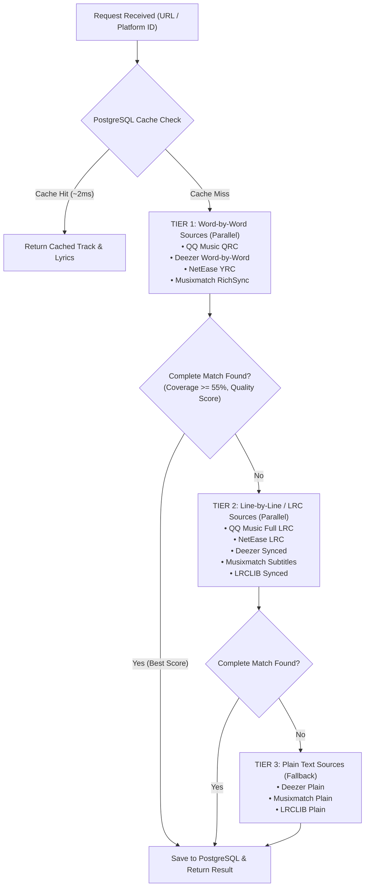

## Overview of Streaming Platforms

LyricsDB accepts standard track URLs or direct platform identifiers:

| Platform | Canonical Key | Accepted Aliases | Metadata | Syllable Sync | Line Sync |
| :--- | :--- | :--- | :--- | :--- | :--- |
| **Spotify** | `spotify` | `spotify` | Full (ISRC, Album Art, Duration) | Yes (via RichSync / QQ / Deezer) | Yes (LRC) |
| **Apple Music** | `apple` | `applemusic`, `apple`, `itunes` | Full (ISRC, Artwork, Duration) | Yes (TTML) | Yes |
| **Deezer** | `deezer` | `deezer` | Full (ISRC, Artwork, Duration) | Yes (Word-by-Word) | Yes (Synced LRC) |
| **NetEase Cloud Music** | `netease` | `netease`, `163`, `neteasemusic` | Full (Cover Art, Duration) | Yes (YRC) | Yes (LRC) |
| **QQ Music** | `qq` | `qq`, `qqmusic` | Full (Cover Art, Duration) | Yes (QRC) | Yes (LRC) |
| **ISRC Lookup** | `isrc` | `isrc` | Universal Cross-Match | Yes | Yes |

---

## Upstream Lyrics Providers

When resolving lyrics, LyricsDB aggregates and scores candidates across multiple specialized lyrics providers:

| Provider | Identifier | Syllable / Word Precision | Line-by-Line | Plain Text |
| :--- | :--- | :--- | :--- | :--- |
| **QQ Music** | `qqmusic` | QRC XML with millisecond syllables | LRC line timing | Plain |
| **Deezer** | `deezer` | Synchronized word-by-word lines | Synchronized line timestamps | Plain |
| **NetEase** | `netease` | YRC syllable-level timed lyrics | LRC line timestamps | Plain |
| **Musixmatch** | `musixmatch` | RichSync tokenized word timing | Subtitle line timestamps | Plain |
| **LRCLIB** | `lrclib` | — | Synchronized LRC lines | Plain |

---

## Tiered Concurrent Resolution Engine

To provide the fastest response times while maximizing lyric quality, LyricsDB executes a **3-tier prioritized resolution strategy**:



### Quality Scoring & Validation

Every candidate lyric payload is evaluated using an automated scoring algorithm:
- **Duration Coverage Ratio**: Candidate duration is compared against official track metadata (requiring &ge; 55% track coverage for songs &ge; 60 seconds).
- **Timing Precision Bonus**: Syllable/word-by-word (+1000 base pts), Line-by-line (+500 base pts), Plain text (+100 base pts).
- **Vocal Arrangement Scoring**: Extra score weighting for rich vocal roles including background vocals, duet leads, and duet background tracks.
- **Deduplication & Thundering Herd Protection**: Concurrent requests for the same uncached track share a single in-flight resolution worker.

---

## Example Queries by Platform

```bash
# 1. Spotify Track ID
curl "http://localhost:4000/api/tracks?platform=spotify&id=4cOdK2wGLETKBW3PvgPWqT"

# 2. Apple Music Track ID
curl "http://localhost:4000/api/tracks?platform=apple&id=1559523359"

# 3. Deezer Track ID
curl "http://localhost:4000/api/tracks?platform=deezer&id=3537337561"

# 4. NetEase Song ID
curl "http://localhost:4000/api/tracks?platform=netease&id=2755500197"

# 5. QQ Music Song Mid/ID
curl "http://localhost:4000/api/tracks?platform=qq&id=000f1Vqw2ACkez"

# 6. Direct ISRC Lookup
curl "http://localhost:4000/api/tracks?platform=isrc&id=USQX92504224"
```
